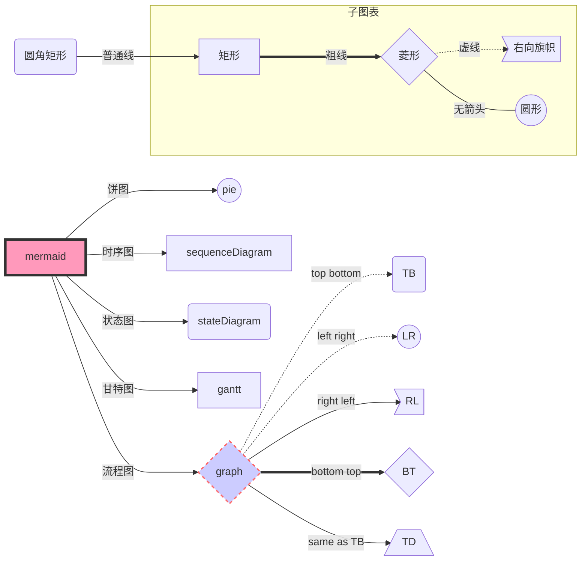
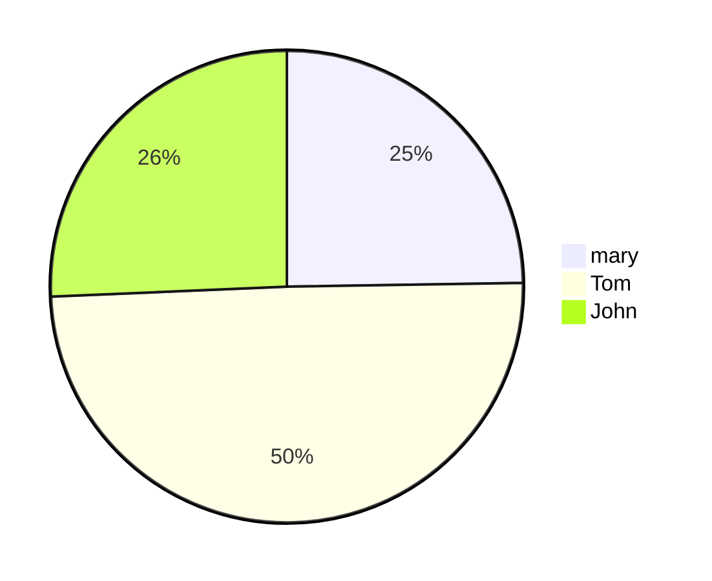
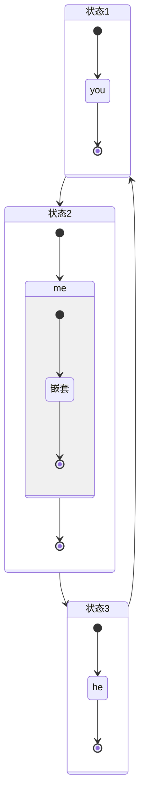
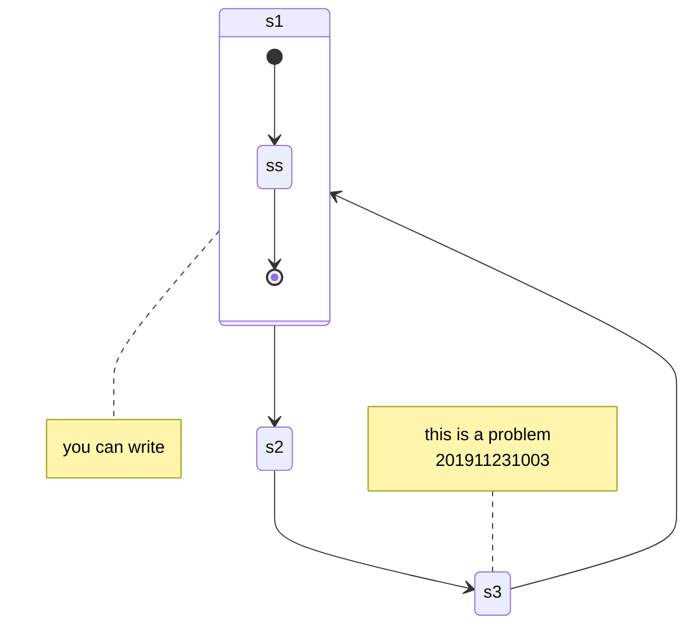
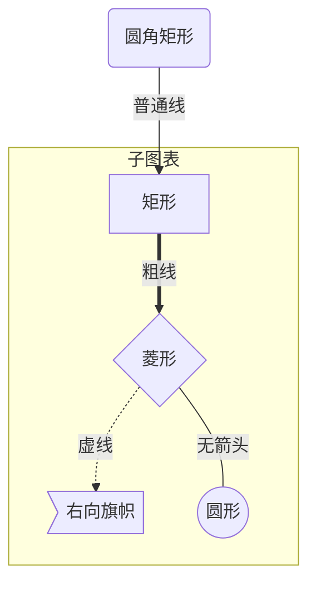

```mermaid
    graph LR
    id1[mermaid] --流程图--> id2{"graph"}
    id1 --"饼图"--> id21(("pie"))
    id1 --时序图--> id22["sequenceDiagram"]
    id1 --状态图--> id23("stateDiagram")
    id1 --> |甘特图|id24["gantt"]
    id2 -.-> |top bottom|id3("TB")
    id2 -.left right.-> id4((LR))
    id2 --right left--> id5>RL]
    id2 ==bottom top==> id6{BT}
    id2 --same as TB--> id7[/TD\]
style id1 fill:#f9b,stroke:#333,stroke-width:4px
style id2 fill:#ccf,stroke:#f66,stroke-width:2px,stroke-dasharray: 5, 5
  
    id8(圆角矩形)--普通线-->id9[矩形]
    subgraph 子图表
        id9==粗线==>id10{菱形}
        id10-.虚线.->id11>右向旗帜]
        id10--无箭头---id12((圆形))
    end

```
---

```mermaid
    pie
    "mary" :10.21
    "Tom" :20.45
    "John" :10.59
```
---

```mermaid
    stateDiagram
     状态1 --> 状态2 
     状态2 --> 状态3
     状态3 --> 状态1
    state 状态2 { 
    [*] --> me
    me --> [*]
    state me{
        [*]-->嵌套
        嵌套-->[*]

    }
    }
    state 状态1{
      [*] -->you
      you -->[*] 
    }
    state 状态3{
       [*] -->he
       he -->[*] 
    }

```

```mermaid
    stateDiagram
    s1 --> s2
    s2 --> s3
    s3 --> s1
    note right of s1
        you can write
    end note
    state s1{
        [*] --> ss
        ss --> [*]
    }
    note left of s3 : this is a problem  201911231003

    
```
---

```mermaid
    graph TB
    id1(圆角矩形)--普通线-->id2[矩形]
    subgraph 子图表
        id2==粗线==>id3{菱形}
        id3-.虚线.->id4>右向旗帜]
        id3--无箭头---id5((圆形))
    end

```