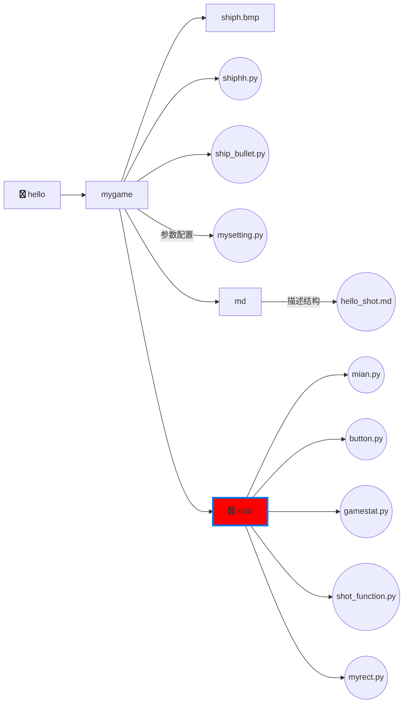

```mermaid
    graph LR
    
   %% id1-->id3[images] 
    id2-->bmp1[shiph.bmp]
    id1["fa:fa-twitter hello"]-->id2[mygame]
    id2-->idship((shiphh.py))
    id2-->idbullet((ship_bullet.py))
    id2--参数配置-->idset((mysetting.py))
    id2-->id22[md]
    id2-->id23[ fa:fa-twitter shot]
    id22--描述结构-->idgra((hello_shot.md))
    id23-->idmain((mian.py))
    id23-->idbutt((button.py))
    id23-->idstat((gamestat.py))
    id23-->idshotfun((shot_function.py))
    id23-->idmyrect((myrect.py))
  style id23 fill:#ff0000,stroke:#0072ec,stroke-width:3.5px
```
idnew((new_funs.py))