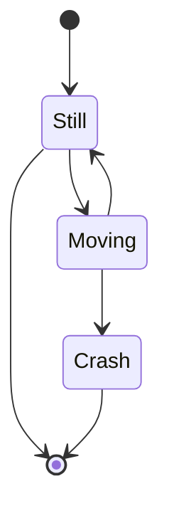
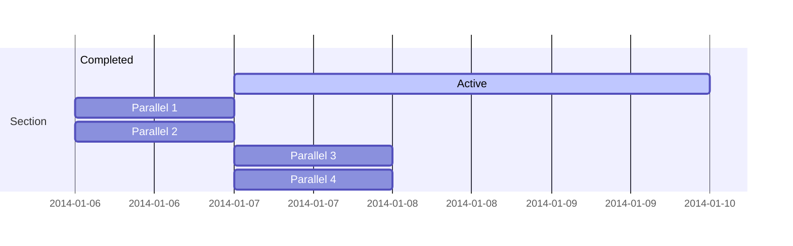
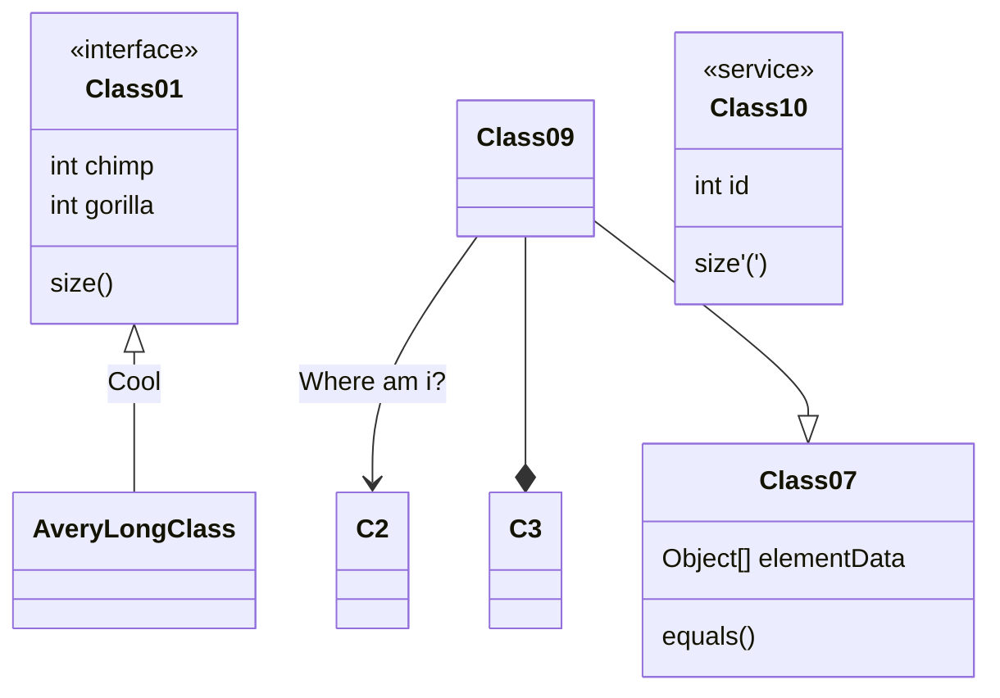
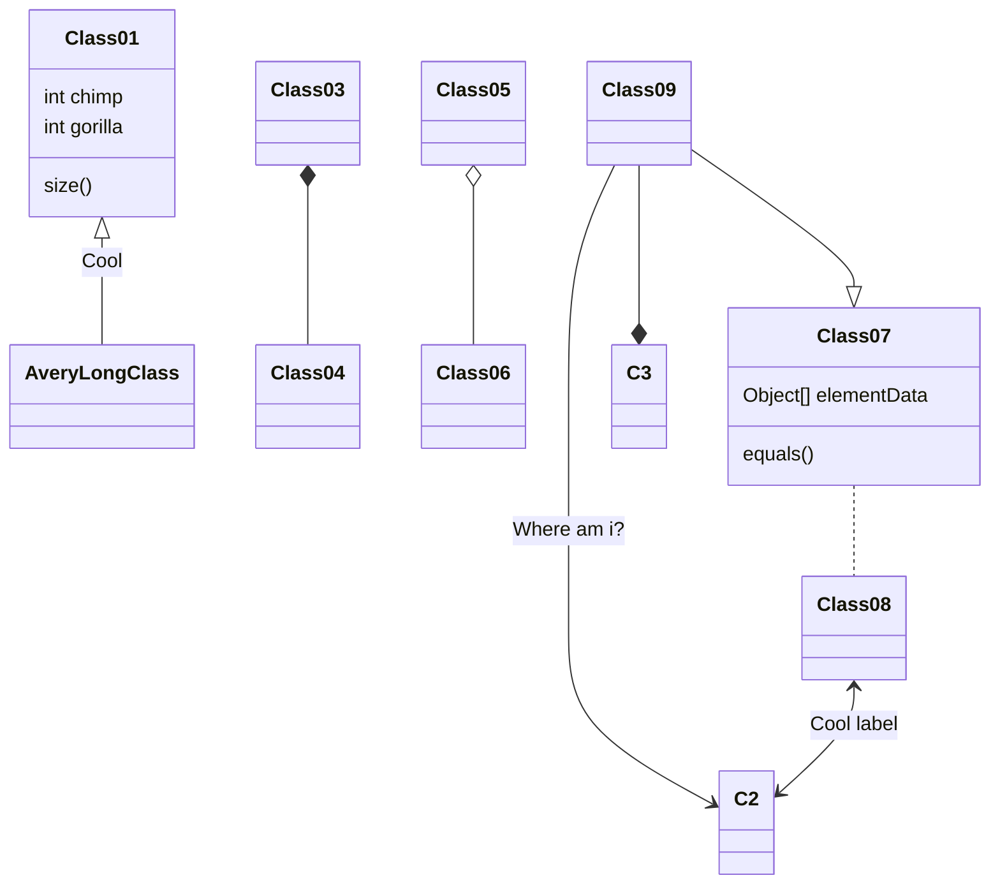
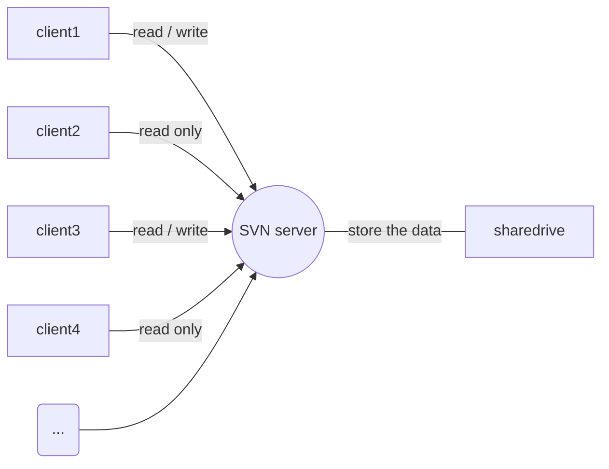

#tolevel

---
| Tables        | Are           | Cool  |
| ------------- |:-------------:| -----:|
| col 3 is      | right-aligned | $1600 |
| col 2 is      | centered      |   $12 |


---








流程图
 
```flow
st=>start: 流程开始
e=>end: 流程结束
 
op1=>operation: 选手准备
op2=>operation: 开始循环
op3=>operation: 执行循环语句
op4=>operation: 循环结束 
 
cond1=>condition: 准备好了么
cond2=>condition: 判断循环条件
 
 
st->op1->cond1
cond1(yes, right)->op2(right)->cond2
cond1(no)->op1
cond2(yes)->op3->cond2
cond2(no)->op4->e

```
```flow
st=>start: 开始
e=>end: 结束
c1=>condition: A
c2=>condition: B
c3=>condition: C
io=>inputoutput: D
st->c1(no)->e
c2(no)->e
c3(no)->e
c1(yes,right)->c2(yes,right)->c3(yes,right)->io
io->e
```


code:
```plantumlcode
@startuml
title 类图
note "类图部分符合示意" as comment
@enduml
```