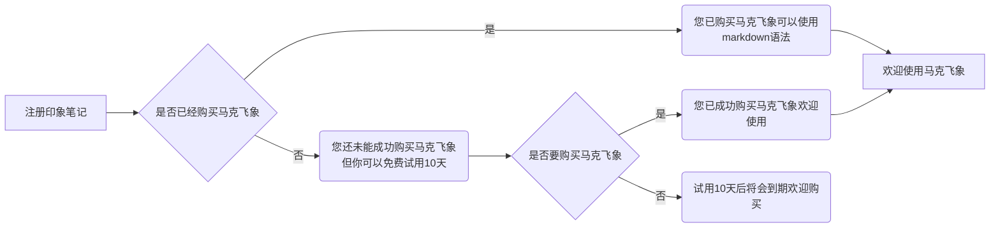
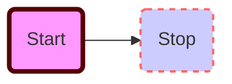

# d

## d

 - [ ] 1定义节点
名称=>类型：内容
类型有：start
        end
        operation 
        subroutine （循环）
        condition
        inputoutput （输入输出）
        parallel 允许多个流同时发生
        eg： st=>start: 注册
              e=>end: 结束
op1=>operation: 登陆
op2=>operation: 购买并登陆
cond=>condition: 是否已登陆购买
 - [ ] 2节点关系
  ->   eg：st->op1->cond
 - [ ] 3判断型节点
  根据yes 和no 指向 不同节点
cond(yes)->e
cond(no)->op2->e
##判断型节点 根据yes 和no 指向 不同节点

```flow
st=>start: 注册
e=>end: 结束
op1=>operation: 登陆
op2=>operation: 购买并登陆
cond=>condition: 是否已登陆购买
st->op1->cond
cond(yes)->e
cond(no)->op2->e
``` 





​```sequence
Title: Here is title
Alice->Bob: Hello Bob, how are you?
Note right of Bob: Bob thinks
Bob-->Alice: I am good thanks!
​```


[](http://github.com)

### d


colspan `>` or `empty cell`:

| a | b |
|---|---|
| > | 1 |

rowspan `^`:

#dd

:smile:
:fa-car:

30^th^

H~~0
''' if TRUE: 
        run()
    else if:
        play()
'''


$f(x) =sin(x) +12$
 parse -> execute;
   main -> init;
   main -> cleanup;
   execute -> make_string;
   execute -> printf
   init -> make_string;
   main -> printf;
   execute -> compare;
 }
'/>


<details> 
<summary></summary>
custom_mark10
  digraph G {
    size ="4,4";
    main [shape=box];
    main -> parse [weight=8];
    parse -> execute;
    main -> init [style=dotted];
    main -> cleanup;
    execute -> { make_string; printf};
    init -> make_string;
    edge [color=red];
    main -> printf [style=bold,label="100 times"];
    make_string [label="make a string"];
    node [shape=box,style=filled,color=".7 .3 1.0"];
    execute -> compare;
  }
custom_mark10
</details>

---------------------------------

<details> 
<summary></summary>
custom_mark12
/**
*Structural Things
*@opt commentname
*@note Notes can
*be extended to
*span multiple lines
*/
class Structural{}

/**
*@opt all
*@note Class
*/
class Counter extends Structural {
        static public int counter;
        public int getCounter();
}

/**
*@opt shape activeclass
*@opt all
*@note Active Class
*/
class RunningCounter extends Counter{}
custom_mark12
</details>
---
***


![Alt text](http://www.gravizo.com/img/1x1.png#

thiisthemark        
@startuml
object Object01
object Object02
object Object03
object Object04
object Object05
object Object06
object Object07
object Object08

Object01 <|-- Object02
Object03 *-- Object04
Object05 o-- "4" Object06
Object07 .. Object08 : some labels
@enduml
thiisthemark        
        


