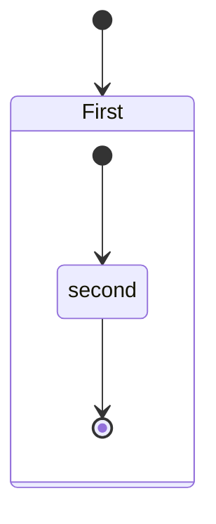
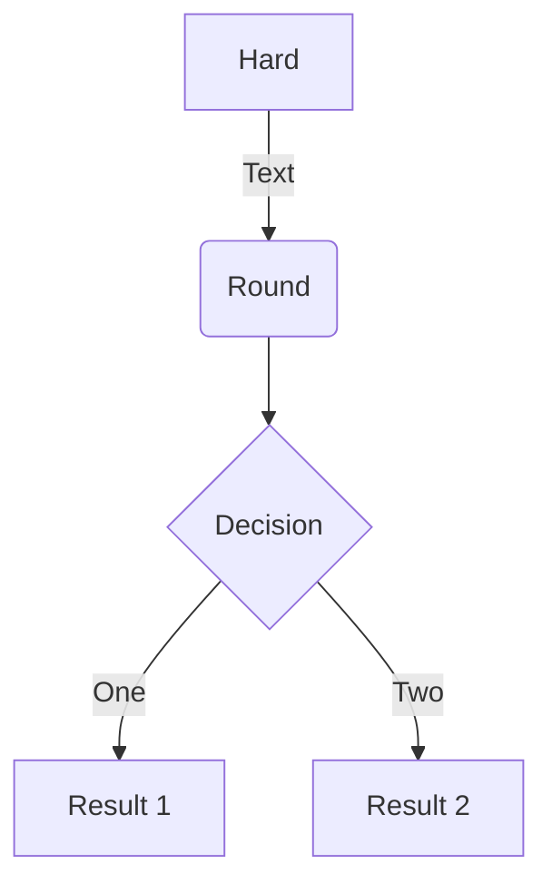
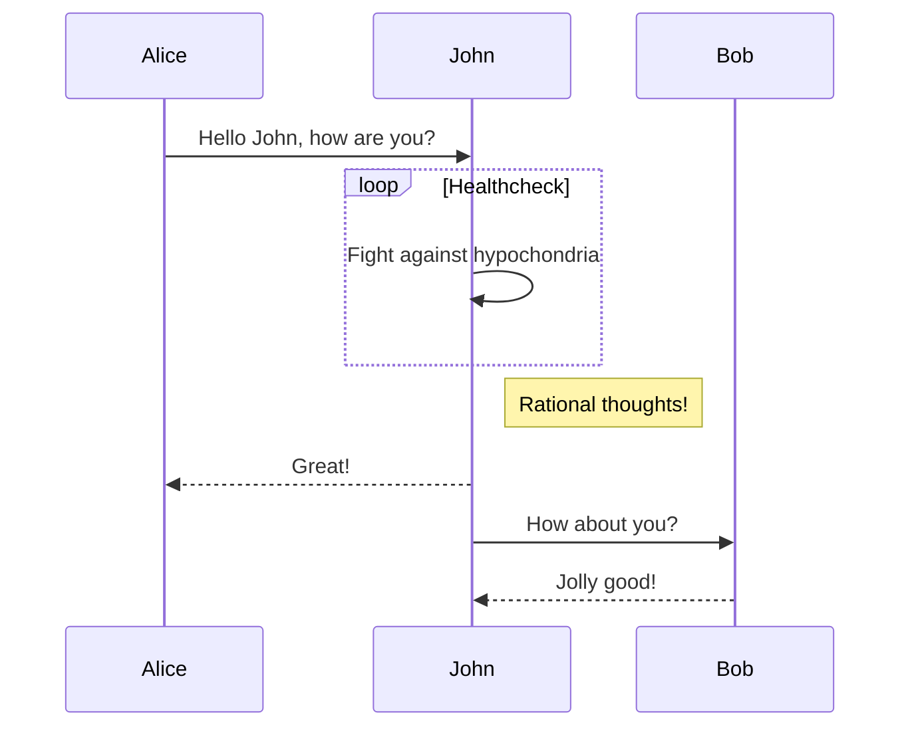
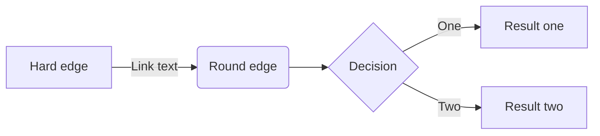
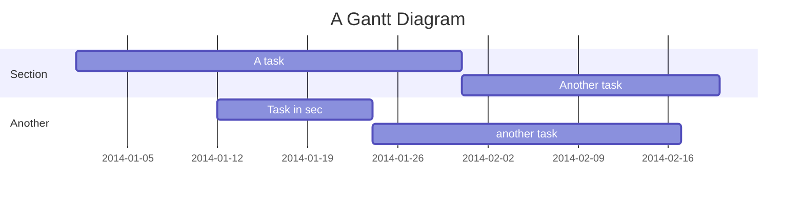
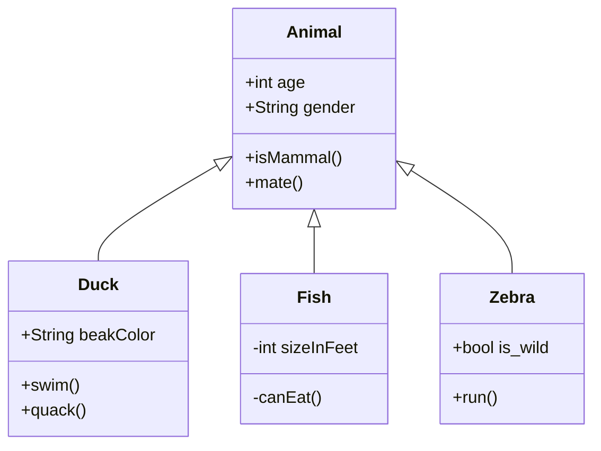
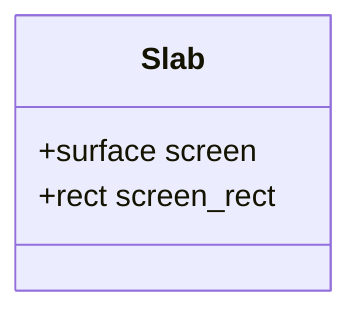

```mermaid
    stateDiagram
	    [*] --> First 
	    state First {
		[*]-->second
		second --> [*]

	}

```

```mermaid
graph TD
A[Hard] -->|Text| B(Round)
B --> c{Decision}
c -->|One| D[Result 1]
c -->|Two| E[Result 2]
```

```mermaid
    sequenceDiagram 
        Alice->>John: Hello John, how are you?
        loop Healthcheck
        John->>John: Fight against hypochondria
        end
        Note right of John: Rational thoughts!
        John-->>Alice: Great!
        John->>Bob: How about you?
        Bob-->>John: Jolly good!
```

```mermaid
	graph LR
    A[Hard edge] -->|Link text| B(Round edge)
    B --> C{Decision}
    C -->|One| D[Result one]
    C -->|Two| E[Result two]
```

```mermaid
	gantt
    title A Gantt Diagram
    dateFormat  YYYY-MM-DD
    section Section
    A task           :a1, 2014-01-01, 30d
    Another task     :after a1  , 20d
    section Another
    Task in sec      :2014-01-12  , 12d
    another task      : 24d

```

```mermaid
    classDiagram
      Animal <|-- Duck
      Animal <|-- Fish
      Animal <|-- Zebra
      Animal : +int age
      Animal : +String gender
      Animal: +isMammal()
      Animal: +mate()
      class Duck{
          +String beakColor
          +swim()
          +quack()
      }
      class Fish{
          -int sizeInFeet
          -canEat()
      }
      class Zebra{
          +bool is_wild
          +run()
      }
```
#Slab
---
##ball

```mermaid
	classDiagram
        Slab : +surface screen
		Slab : +rect screen_rect

```

```mermaid
	flowchat
	st=>start: start
	e=>end: end
	op=>operation: what you want
	cond=>condition: Sure？

	st->op->cond
	cond(yes)->e
	cond(no)->op


```